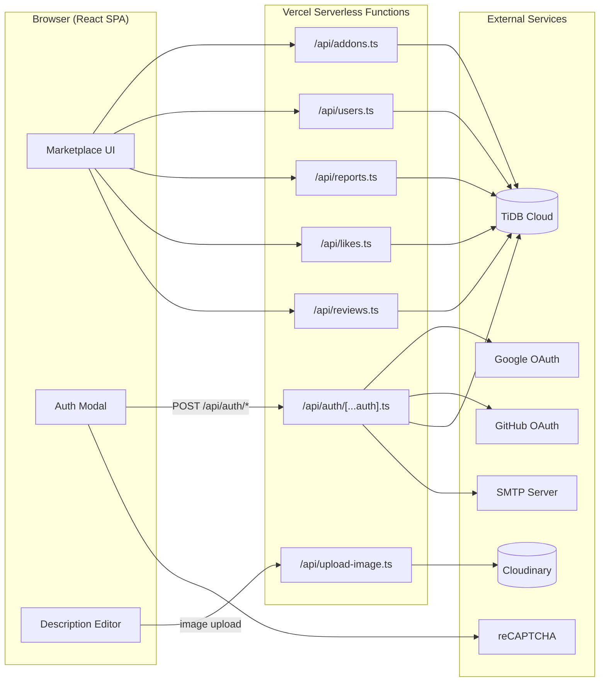
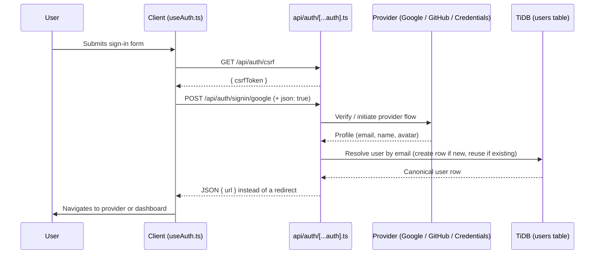
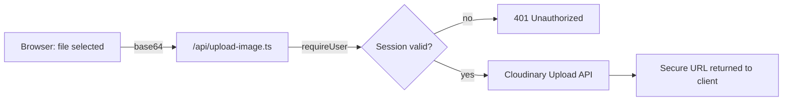

<p align="center">
  
</p>

<p align="center">
  
  
  
  
  
  
  
  
</p>

<p align="center">
  A web marketplace for Minecraft add-ons, texture packs, and resource packs — built for creators to publish and players to discover.
</p>

<p align="center">
  <a href="https://voltra-essentials.my.id"><strong>Visit the live site »</strong></a>
</p>

---

## Table of Contents

- [Overview](#overview)
- [Features](#features)
- [Tech Stack](#tech-stack)
- [Architecture](#architecture)
- [Data Model](#data-model)
- [Project Structure](#project-structure)
- [Getting Started](#getting-started)
- [Environment Variables](#environment-variables)
- [Authentication Flow](#authentication-flow)
- [Media Uploads](#media-uploads)
- [API Reference](#api-reference)
- [Security Notes](#security-notes)
- [Migration History](#migration-history)
- [Deployment](#deployment)
- [Roadmap](#roadmap)
- [Contributing](#contributing)
- [License](#license)

---

## Overview

**Voltra Marketplace** (also known as Voltra Essentials) is where the Minecraft community browses, uploads, and downloads add-ons, texture packs, and resource packs. It's a single-page React application backed by Vercel Serverless Functions, with **TiDB Cloud** (MySQL-compatible) as the system of record, **Cloudinary** for image hosting, and **Auth.js** managing sign-in across Google, GitHub, and email/password.

The goal is simple: make it fast to find good content, and just as easy for creators to share their own.

---

## Features

- **Search & discovery** — full-text search across add-ons, tags, and authors, with Newest and Popular sort modes plus category filters
- **Multi-provider authentication** — Google, GitHub, and email/password, unified by email so the same person never ends up with duplicate accounts across sign-in methods
- **Account lifecycle emails** — branded HTML emails for verification and password reset, sent through SMTP
- **Creator-friendly catalog** — content organized by type (Add-ons, Textures, Animations, Action packs, and more) with rich tag support and a rich-text description editor
- **Reviews & moderation** — one rating per user per add-on, plus a report queue admins can resolve from the Admin Panel
- **Relational data layer** — TiDB Cloud enforces referential integrity (foreign keys, unique constraints) at the database level, with authorization handled server-side in each API route
- **Sanitized rich content** — add-on descriptions run through DOMPurify with a strict tag/attribute allowlist before storage and before render

---

## Tech Stack

| Layer                | Technology                                              |
| --------------------- | -------------------------------------------------------- |
| Frontend               | React 19 · TypeScript · Vite                              |
| Authentication          | Auth.js (`@auth/core`, v5) — Google, GitHub & Credentials |
| API / Backend            | Vercel Serverless Functions (`@vercel/node`)               |
| Database                 | TiDB Cloud (MySQL-compatible) via `mysql2`                  |
| Media hosting              | Cloudinary                                                    |
| Transactional email        | Nodemailer over SMTP                                           |
| Bot protection              | Google reCAPTCHA                                                 |
| Content sanitization         | DOMPurify (server- and client-side)                                |
| Hosting / CI-CD               | Vercel (auto-deploy on push to `main`)                              |

---

## Architecture



All read/write access to TiDB goes through the API layer — the browser never talks to the database directly. Every mutating route checks the caller's session (`requireUser` / `requireAdmin`) before touching a row.

---

## Data Model

Five tables, defined in [`schema.sql`](./schema.sql):

| Table      | Purpose                                                                 | Key constraints                                            |
| ----------- | ------------------------------------------------------------------------ | ------------------------------------------------------------ |
| `users`      | One row per person, regardless of sign-in method                          | `email` is `UNIQUE` — this is what prevents duplicate accounts |
| `addons`      | Marketplace listings                                                       | `author_id` → `users.id`                                       |
| `likes`        | Heart/favorite records                                                      | `UNIQUE(user_id, addon_id)` — one like per user per add-on        |
| `reviews`       | Star ratings + comments                                                      | `UNIQUE(user_id, addon_id)` — one review per user per add-on         |
| `reports`         | User-submitted moderation reports                                             | Resolved/pending status, visible to admins                             |

The `users.email` unique constraint is the load-bearing fix behind multi-provider login: whichever provider a person signs in with, the same email always resolves to the same row.

---

## Project Structure

```
Marketplace/
├── api/
│   ├── auth/
│   │   └── [...auth].ts       # Auth.js catch-all route (signin, callback, csrf, session)
│   ├── addons.ts               # List/create/edit/delete add-ons, download counter
│   ├── users.ts                 # Admin user list, public profile, self profile update
│   ├── reports.ts                 # Submit/list/resolve moderation reports
│   ├── likes.ts                    # Toggle like, list a user's likes
│   ├── reviews.ts                   # Submit/list reviews, keeps average_rating in sync
│   ├── upload-image.ts               # Cloudinary upload proxy (keeps credentials server-side)
│   ├── register.ts                    # Email/password sign-up
│   ├── forgot-password.ts              # Password reset request
│   ├── reset-password.ts                # Password reset confirmation
│   ├── verify-email.ts                   # Email verification link handler
│   └── resend-verification.ts             # Resend verification email
├── src/
│   ├── lib/
│   │   ├── db.ts                       # mysql2 connection pool (TiDB Cloud)
│   │   ├── userStore.ts                 # Email-first user resolution/upsert, admin allowlist
│   │   ├── apiAuth.ts                     # requireUser / requireAdmin session guards
│   │   └── utils.ts                        # Shared validation & payload builders
│   ├── components/                          # UI components (Marketplace, AdminPanel, UploadModal, ...)
│   └── hooks/
│       ├── useAuth.ts                         # Session state, sign-in/out
│       └── useAddons.ts                        # Add-on list, likes, create
├── icon/
│   └── banner.svg                                # README banner
├── schema.sql                                       # TiDB table definitions
├── auth_config.ts                                     # Auth.js provider & callback configuration
├── index.html                                          # App entry point + SEO/Open Graph meta tags
├── vercel.json                                          # Vercel rewrites (SPA fallback)
├── vite.config.ts                                        # Vite build configuration
└── package.json
```

---

## Getting Started

### Prerequisites

- Node.js 18+
- A [TiDB Cloud](https://tidbcloud.com) Serverless cluster (free tier is sufficient)
- A [Cloudinary](https://cloudinary.com) account
- Google and GitHub OAuth app credentials
- An SMTP account (for verification & password reset emails)

### Installation

```bash
git clone https://github.com/RakaMC2/Marketplace.git
cd Marketplace
npm install
```

### Set up the database

1. In the TiDB Cloud SQL Editor, run the contents of [`schema.sql`](./schema.sql) against a database named to match your `TIDB_DATABASE` env var.
2. Copy `.env.example` to `.env.local` and fill in your credentials.

### Run locally

```bash
npm run dev
```

By default, Vite serves the app at `http://localhost:5173`.

### Build for production

```bash
npm run build
```

---

## Environment Variables

Create a `.env.local` file in the project root (see [`.env.example`](./.env.example) for the full template):

| Variable                | Description                                        |
| ------------------------- | ----------------------------------------------------- |
| `TIDB_HOST`                 | TiDB Cloud cluster host                                  |
| `TIDB_PORT`                   | TiDB Cloud cluster port (usually `4000`)                    |
| `TIDB_USER`                     | TiDB Cloud username (includes cluster prefix, e.g. `3xxxx.root`) |
| `TIDB_PASSWORD`                   | TiDB Cloud password                                                |
| `TIDB_DATABASE`                     | Database name (must match what `schema.sql` was run against)         |
| `AUTH_SECRET`                         | Secret used by Auth.js to sign/encrypt tokens                          |
| `GOOGLE_CLIENT_ID`                      | Google OAuth client ID                                                   |
| `GOOGLE_CLIENT_SECRET`                    | Google OAuth client secret                                                 |
| `GITHUB_CLIENT_ID`                          | GitHub OAuth client ID                                                       |
| `GITHUB_CLIENT_SECRET`                        | GitHub OAuth client secret                                                     |
| `CLOUDINARY_CLOUD_NAME`                         | Cloudinary cloud name                                                            |
| `CLOUDINARY_API_KEY`                              | Cloudinary API key                                                                 |
| `CLOUDINARY_API_SECRET`                             | Cloudinary API secret                                                                |
| `SMTP_HOST` / `SMTP_PORT`                             | SMTP server host and port                                                              |
| `SMTP_USER` / `SMTP_PASS`                               | SMTP credentials                                                                          |
| `SMTP_FROM`                                               | "From" address for outgoing emails                                                          |
| `RECAPTCHA_SITE_KEY` / `RECAPTCHA_SECRET_KEY`               | reCAPTCHA public and private keys                                                              |

> Never commit `.env.local` or any file containing real credentials to version control. Configure the same variables in the Vercel project's Environment Variables settings for production.

---

## Authentication Flow

All authentication traffic is handled by a single Auth.js **catch-all route** at `api/auth/[...auth].ts`, which converts Vercel's request/response objects into standard Web `Request`/`Response` objects for `@auth/core`.



Two details worth calling out:

- **JSON instead of a redirect.** The client requests a JSON response by sending `json: 'true'` in the request body. On the server this becomes the `X-Auth-Return-Redirect: 1` header that `@auth/core` expects — without it, `fetch()` would silently follow the redirect itself, breaking the JSON-based flow the frontend relies on.
- **Email-first resolution, not provider-ID-first.** Every OAuth sign-in resolves the user by `email` (see `resolveOAuthUser` in `src/lib/userStore.ts`) before falling back to creating a new row. This is what makes it safe for the same person to sign up with a password and later continue with Google, or switch between Google and GitHub, without ending up with split accounts.

---

## Media Uploads

Add-on cover images, description images, and profile photos are uploaded through `api/upload-image.ts`, which proxies to Cloudinary. Cloudinary credentials are read only on the server — the browser never sees them, and every upload requires an authenticated session (`requireUser`).



---

## API Reference

All routes live under `/api` and use query-string parameters for resource IDs (e.g. `/api/addons?id=xxx`) rather than dynamic path segments, so routing has no dependency on framework-specific conventions.

| Route              | Methods                    | Notes                                                    |
| -------------------- | ---------------------------- | ----------------------------------------------------------- |
| `/api/addons`           | `GET`, `POST`                  | List (filtered by role/ownership) or create an add-on          |
| `/api/addons?id=`          | `PATCH`, `DELETE`                | Edit / moderate / delete a single add-on                          |
| `/api/addons?id=&action=download` | `POST`               | Increments the download counter                                     |
| `/api/users`               | `GET`                             | Admin-only user list                                                  |
| `/api/users?id=`               | `GET`, `PATCH`, `DELETE`             | Public profile / role change (admin) / delete (admin)                    |
| `/api/users?scope=me`               | `PATCH`                                | Update your own profile                                                     |
| `/api/likes`                         | `GET`, `POST`                            | List your likes / toggle a like                                               |
| `/api/reviews`                        | `GET`, `POST`                              | List reviews for an add-on / submit a review                                    |
| `/api/reports`                          | `GET`, `POST`                                | List reports (own, or all for admins) / submit a report                            |
| `/api/reports?id=`                       | `PATCH`                                        | Resolve a report (admin)                                                             |
| `/api/upload-image`                        | `POST`                                          | Upload an image via the Cloudinary proxy                                               |

---

## Security Notes

- **Rich text is sanitized twice.** `DescriptionEditor.tsx` runs content through DOMPurify with `<iframe>` removed from the allowlist and a hook that strips any `style` attribute containing `url()`, `expression()`, `behavior:`, `@import`, or `javascript:`. Sanitization happens **before** content leaves the editor, not just at render time.
- **No client-side secrets.** Cloudinary and any third-party API keys are read exclusively inside `/api` routes, never bundled into client JavaScript.
- **Admin access is allowlisted by email**, resolved server-side in `src/lib/userStore.ts` — it cannot be granted by a client request.
- **Unique-email constraint at the database level.** Even if application logic had a bug, `users.email UNIQUE` in `schema.sql` makes duplicate-account creation structurally impossible, not just discouraged.

---

## Migration History

This project has moved through two infrastructure migrations:

1. **Firestore → TiDB Cloud (MySQL).** The original Firestore-based data layer (see `firestore.rules` for the legacy rule set) was replaced with a relational schema on TiDB Cloud. All client-side Firestore SDK calls were replaced with calls to the `/api` layer described above, and Firestore's per-document security rules were replaced with server-side `requireUser`/`requireAdmin` checks plus SQL constraints (`UNIQUE`, `FOREIGN KEY`).
2. **ImgBB → Cloudinary.** Image hosting moved from ImgBB to Cloudinary for more reliable delivery and transformation support. Uploads still go through a server-side proxy (`api/upload-image.ts`) so provider credentials never reach the browser.

---

## Deployment

The project is deployed on **Vercel**. Every push to `main` triggers an automatic production build and deployment. Before deploying, make sure all variables from [Environment Variables](#environment-variables) are set in the Vercel dashboard under **Project → Settings → Environment Variables**, and that `schema.sql` has been run against your TiDB Cloud database.

> Vercel's Hobby plan caps a deployment at 12 Serverless Functions. The API routes above are kept intentionally flat (query-param routing instead of one file per dynamic segment) to stay well under that limit.

---

## Roadmap

- [ ] Creator dashboard for managing uploads
- [ ] Download analytics for creators
- [ ] Public API for third-party integrations
- [ ] Rate limiting on auth and upload endpoints
- [ ] Automated test coverage for the API layer

---

## Contributing

Contributions are welcome.

1. Fork the repository
2. Create a feature branch — `git checkout -b feature/your-feature`
3. Commit your changes — `git commit -m "Add your feature"`
4. Push the branch — `git push origin feature/your-feature`
5. Open a Pull Request

---

## License

This project currently has no published license. Please contact the repository owner before reusing or redistributing this code.

<p align="center">
  <sub>Built with care for the Minecraft community.</sub>
</p>
