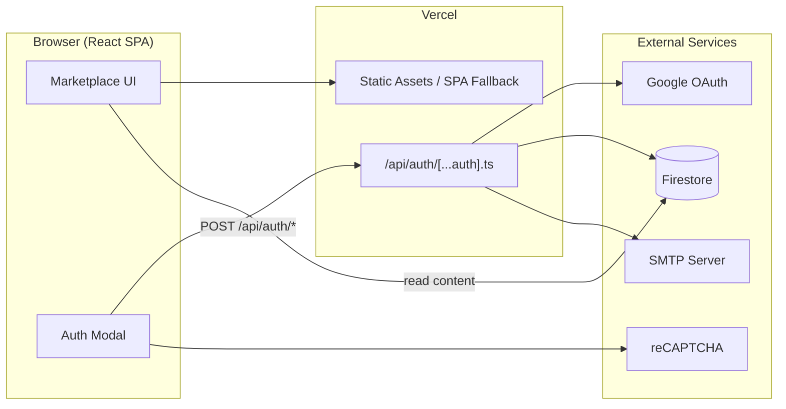
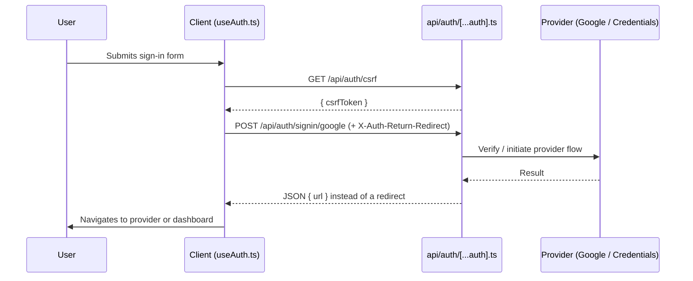

<p align="center">
  
</p>

<p align="center">
  
  
  
  
  
  
  
</p>

<p align="center">
  A web marketplace for Minecraft add-ons, texture packs, and resource packs — built for creators to publish and players to discover.
</p>

<p align="center">
  <a href="https://voltra-essentials.my.id"><strong>Visit the live site »</strong></a>
</p>

---

## Table of Contents

- [Overview](#overview)
- [Features](#features)
- [Tech Stack](#tech-stack)
- [Architecture](#architecture)
- [Project Structure](#project-structure)
- [Getting Started](#getting-started)
- [Environment Variables](#environment-variables)
- [Authentication Flow](#authentication-flow)
- [Deployment](#deployment)
- [Roadmap](#roadmap)
- [Contributing](#contributing)
- [License](#license)

---

## Overview

**Voltra Marketplace** (also known as Voltra Essentials) is where the Minecraft community browses, uploads, and downloads add-ons, texture packs, and resource packs. It's built as a single-page React application backed by serverless functions on Vercel, with Firebase handling data storage and Auth.js managing sign-in.

The goal is simple: make it fast to find good content, and just as easy for creators to share their own.

---

## Features

- **Search & discovery** — full-text search across add-ons, tags, and authors, with Newest and Popular sort modes plus category filters
- **Secure authentication** — email/password and Google sign-in, protected by reCAPTCHA and CSRF-safe by default
- **Account lifecycle emails** — branded HTML emails for email verification and password reset, sent through SMTP
- **Creator-friendly catalog** — content organized by type (Add-ons, Textures, Animations, Action packs, and more) with rich tag support
- **Cloud-native data layer** — Firestore for content and user data, with security rules enforced server-side

---

## Tech Stack

| Layer            | Technology                                    |
| ----------------- | ---------------------------------------------- |
| Frontend          | React · TypeScript · Vite                      |
| Authentication     | Auth.js (`@auth/core`, v5) — Google & Credentials |
| API / Backend      | Vercel Serverless Functions (`@vercel/node`)    |
| Database           | Firebase / Firestore                            |
| Transactional email | Nodemailer over SMTP                            |
| Bot protection      | Google reCAPTCHA                                |
| Hosting / CI-CD     | Vercel (auto-deploy on push to `main`)          |

---

## Architecture



---

## Project Structure

```
Marketplace/
├── api/
│   └── auth/
│       └── [...auth].ts       # Auth.js catch-all route (signin, callback, csrf, session)
├── docs/
│   └── banner.svg             # README banner
├── src/                       # Frontend source (components, pages, hooks)
│   ├── components/
│   │   ├── AuthModal.tsx
│   │   └── AuthCard.tsx
│   └── hooks/
│       └── useAuth.ts
├── auth.config.ts             # Auth.js provider & callback configuration
├── firebase-blueprint.json    # Firebase project configuration
├── firestore.rules            # Firestore security rules
├── index.html                 # App entry point + SEO/Open Graph meta tags
├── vercel.json                # Vercel rewrites (SPA fallback)
├── vite.config.ts             # Vite build configuration
└── package.json
```

---

## Getting Started

### Prerequisites

- Node.js 18+
- A Firebase project with Firestore enabled and Admin SDK credentials
- A Google OAuth client ID/secret (for Google sign-in)
- An SMTP account (for verification & password reset emails)

### Installation

```bash
git clone https://github.com/RakaMC2/Marketplace.git
cd Marketplace
npm install
```

### Run locally

```bash
npm run dev
```

By default, Vite serves the app at `http://localhost:5173`.

### Build for production

```bash
npm run build
```

---

## Environment Variables

Create a `.env.local` file in the project root:

| Variable               | Description                                  |
| ----------------------- | --------------------------------------------- |
| `AUTH_SECRET`           | Secret used by Auth.js to sign/encrypt tokens |
| `AUTH_GOOGLE_ID`        | Google OAuth client ID                        |
| `AUTH_GOOGLE_SECRET`    | Google OAuth client secret                    |
| `FIREBASE_PROJECT_ID`   | Firebase project ID                           |
| `FIREBASE_CLIENT_EMAIL` | Firebase service account client email         |
| `FIREBASE_PRIVATE_KEY`  | Firebase service account private key          |
| `SMTP_HOST`             | SMTP server host                              |
| `SMTP_PORT`             | SMTP server port                              |
| `SMTP_USER`             | SMTP username                                 |
| `SMTP_PASS`             | SMTP password                                 |
| `SMTP_FROM`             | "From" address for outgoing emails            |
| `RECAPTCHA_SITE_KEY`    | reCAPTCHA public site key                     |
| `RECAPTCHA_SECRET_KEY`  | reCAPTCHA private secret key                  |

> Never commit `.env.local` or any file containing real credentials to version control. Configure the same variables in the Vercel project's Environment Variables settings for production.

---

## Authentication Flow

All authentication traffic is handled by a single Auth.js **catch-all route** at `api/auth/[...auth].ts`, which converts Vercel's request/response objects into standard Web `Request`/`Response` objects for `@auth/core`.



A key detail: the client requests a **JSON response instead of a redirect** by sending `json: 'true'` in the request body. On the server, this is translated into the `X-Auth-Return-Redirect: 1` header that `@auth/core` expects — without it, the client's `fetch()` would silently follow the redirect itself, which breaks the JSON-based flow the frontend relies on.

---

## Deployment

The project is deployed on **Vercel**. Every push to `main` triggers an automatic production build and deployment. Before deploying, make sure all variables from [Environment Variables](#environment-variables) are set in the Vercel dashboard under **Project → Settings → Environment Variables**.

---

## Roadmap

- [ ] Creator dashboard for managing uploads
- [ ] Ratings & reviews on add-ons
- [ ] Download analytics for creators
- [ ] Public API for third-party integrations

---

## Contributing

Contributions are welcome.

1. Fork the repository
2. Create a feature branch — `git checkout -b feature/your-feature`
3. Commit your changes — `git commit -m "Add your feature"`
4. Push the branch — `git push origin feature/your-feature`
5. Open a Pull Request

---

## License

This project currently has no published license. Please contact the repository owner before reusing or redistributing this code.

<p align="center">
  <sub>Built with care for the Minecraft community.</sub>
</p>
